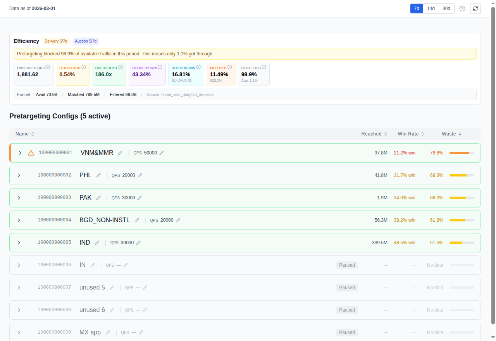

# Chapter 3: Understanding Your QPS Funnel

*Audience: media buyers, campaign managers*

This is the home page of Cat-Scan (`/`). Everything starts here.

## What you see

The QPS Waste Optimizer page shows your RTB funnel (the journey from bid
request to spend) and highlights where volume drops off.

### The funnel

| Stage | What it means |
|-------|---------------|
| **QPS** | The maximum bid requests per second you ask Google to send. Google throttles the actual volume based on your account tier, so you typically receive less than your cap. |
| **Bids** | How many of those requests your bidder chose to bid on. The rest were rejected (wrong inventory, no matching creative, below floor price). |
| **Wins** | Auctions your bidder won. You only pay for wins. |
| **Impressions** | Ads actually served to users after winning. |
| **Clicks** | User interactions with your served ads. |
| **Spend** | Total money spent on won impressions. |

The gap between each stage is where optimization opportunity lives. A large
drop from QPS to Bids means your bidder is rejecting most of what Google sends,
classic waste that pretargeting can fix.

### Key metrics

- **Win rate**: Wins / Bids. How competitive your bids are.
- **CTR**: Clicks / Impressions. How engaging your creatives are.
- **CPM**: Cost per thousand impressions. What you're paying for visibility.
- **Waste ratio**: (QPS - Bids) / QPS. The fraction of traffic you can't use.

### Pretargeting config cards

Below the funnel, you'll see cards for each of your pretargeting
configurations (up to 10 per seat). Each card shows:

- **State**: Active or Suspended
- **Max QPS**: The cap on bid requests this config accepts
- **Formats**: VIDEO, DISPLAY_IMAGE, DISPLAY_HTML, NATIVE
- **Platforms**: DESKTOP, MOBILE_APP, MOBILE_WEB, CONNECTED_TV
- **Geos**: Included and excluded geographic targets
- **Sizes**: Included ad sizes (or all if unfiltered)

### Controls

- **Period selector**: 7, 14, or 30 days of data
- **Seat filter**: scope to a specific buyer seat
- **Config toggle**: drill into a specific pretargeting config

## How to read it

Start with the waste ratio. If it's above 50%, you have significant room to
improve. Then look at which configs contribute the most waste. Click into the
dimension analyses ([Geo](04-analyzing-waste.md), [Publisher](04-analyzing-waste.md),
[Size](04-analyzing-waste.md)) to find the specific sources.

## Related

- [Analyzing Waste by Dimension](04-analyzing-waste.md): drill into geo,
  publisher, and size
- [Pretargeting Configuration](06-pretargeting.md): act on what you find
