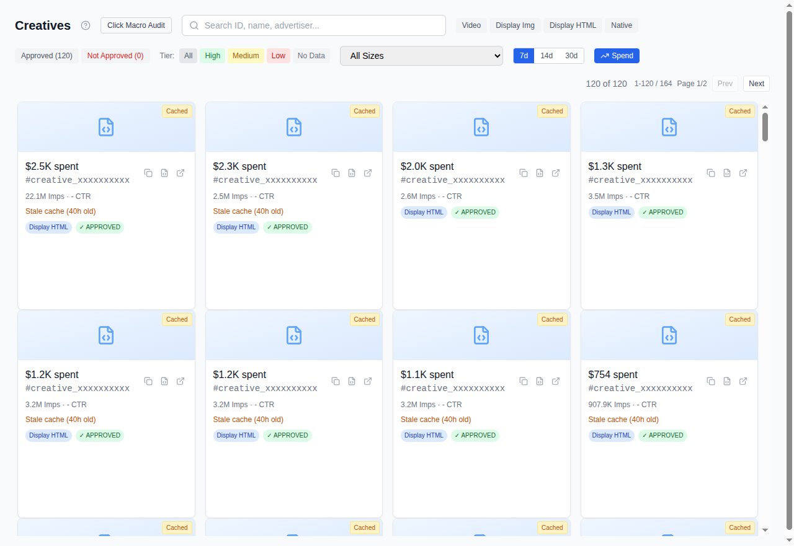

# Chapter 5: Managing Creatives

*Audience: media buyers, campaign managers*

## Creative gallery (`/creatives`)

The gallery shows all creatives associated with your selected seat.

### What you see

Each creative appears as a card with:

- **Thumbnail**: auto-generated preview of the ad (video frame or display
  screenshot)
- **Format badge**: VIDEO, DISPLAY_IMAGE, DISPLAY_HTML, or NATIVE
- **Creative ID**: the Authorized Buyers creative identifier
- **Canonical size**: the primary ad size (e.g., 300x250, 728x90)
- **Performance tier**: HIGH, MEDIUM, LOW, or NO_DATA, based on spend
  percentile ranking within your seat

### Filtering and search

- **Format filter**: show only Video, Display Image, Display HTML, or Native
- **Performance tier filter**: isolate high or low performers
- **Search**: find a creative by its ID
- **Period selector**: 7, 14, or 30 days of performance data

### Thumbnails

Thumbnails are generated in batches. If you see placeholder images, use the
batch thumbnail generation button to queue missing thumbnails. Status is shown
in the UI.

### Creative details

Click any creative to open the preview modal with:

- Destination URL and diagnostics (is the landing page reachable?)
- Language detection (auto-detected + option to override manually)
- Country performance breakdown (which geos this creative performs in)
- Geo-linguistic report (language vs. geography mismatch detection)

**Language mismatch detection** is a distinctive feature: Cat-Scan can flag
cases like a Spanish-language ad running in Arabic markets, or pricing in AED
targeting users in India. This uses your configured AI provider (Gemini,
Claude, or Grok).

## Campaign clustering (`/campaigns`)

Campaigns let you organize creatives into logical groups.

### Views

- **Grid view**: campaign cards with creative count, spend, impressions, clicks
- **List view**: compact table format

### Actions

- **Drag and drop**: move creatives between campaigns or into the unassigned pool
- **Create campaign**: name a new cluster and drag creatives into it
- **AI auto-clustering**: let Cat-Scan suggest groupings based on creative
  attributes (format, size, destination, language)
- **Delete campaign**: removes the grouping (creatives return to the unassigned pool)

### Filters

- **Sort by**: name, spend, impressions, clicks, creative count
- **Country filter**: show only campaigns with creatives running in a
  specific geo
- **Issues filter**: highlight campaigns with problems (mismatches, low
  performers)

## Related

- [Analyzing Waste by Size](04-analyzing-waste.md): size waste ties directly
  to which creatives you have
- [Reading Your Reports](10-reading-reports.md): campaign-level performance
