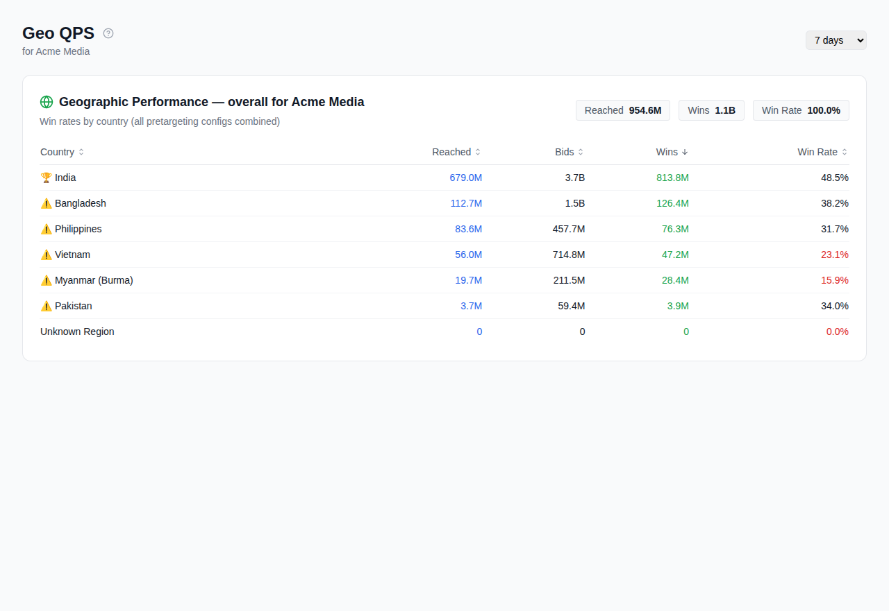
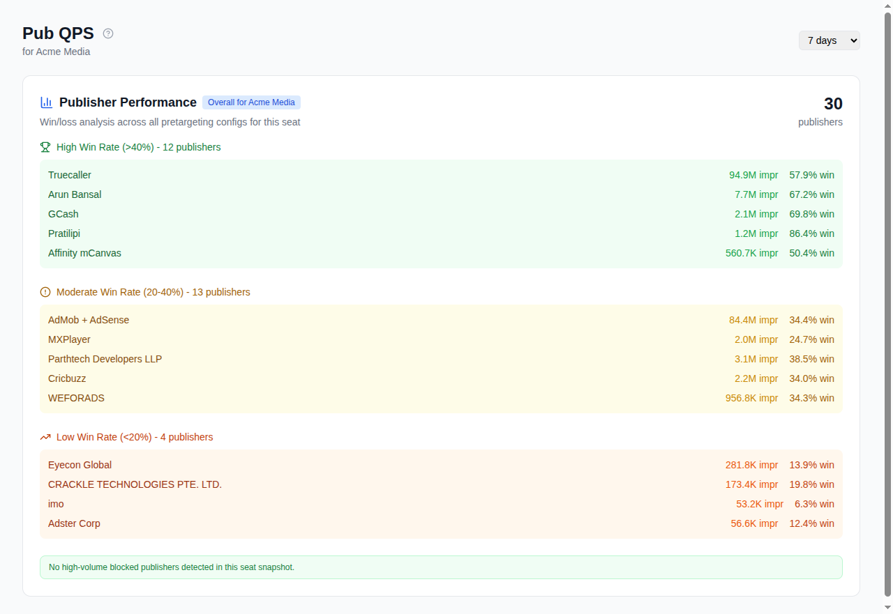
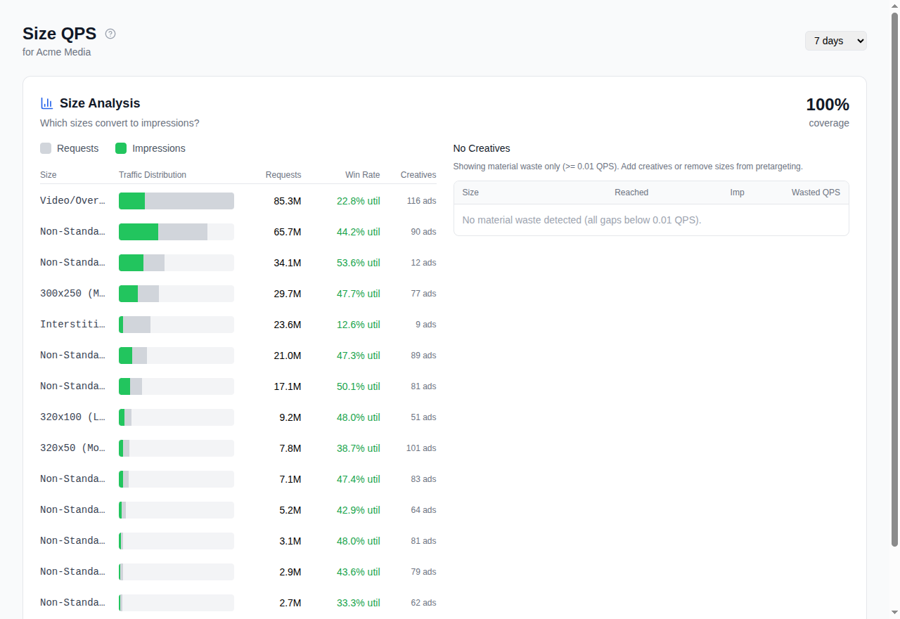

# 第 4 章：按维度分析浪费

*适用读者：媒体买手、投放经理*

当你从[漏斗](03-qps-funnel.md)了解了浪费的*规模*之后，这三个视图告诉你
浪费来自*哪里*。

## 地理浪费（`/qps/geo`）

展示各国家和城市的 QPS 消耗和表现。

**关注什么：**
- QPS 高但胜出为零或接近零的国家，说明 Google 向你发送了你的买手不定向的
  地区流量。
- QPS 占比不成比例但花费很低的城市，长尾地区增加了流量但没有价值。

**如何处理：**
- 将表现不佳的地区添加到预定向排除列表。参见[预定向配置](06-pretargeting.md)。

**控制项：** 时间段选择器（7/14/30 天）、席位筛选器。

## 发布商浪费（`/qps/publisher`）

展示按发布商域名或应用拆分的表现。

**关注什么：**
- 出价量高但展示为零的域名，说明你的竞价器在无法渲染的库存上花费了算力。
- 胜出率异常低的应用或网站，说明你在出价但一直输，浪费了出价评估时间。
- 已知的低质量域名。

**如何处理：**
- 在预定向配置的拒绝列表中屏蔽特定发布商。Cat-Scan 的发布商编辑器
  比 Authorized Buyers UI 操作更简便。

**控制项：** 时间段选择器、地区筛选器、按域名搜索。

## 尺寸浪费（`/qps/size`）

展示哪些广告尺寸收到流量，以及你是否有对应素材。

**关注什么：**
- QPS 高但**没有匹配素材**的尺寸。Google 发送约 400 种不同的广告尺寸。
  如果你投放的是固定尺寸展示广告（非 HTML），大多数尺寸与你无关。每一个
  不匹配尺寸的请求都是纯浪费。
- 有素材但表现不佳的尺寸，考虑素材资产是否适合该格式。

**如何处理：**
- 将无关尺寸添加到预定向的排除尺寸列表。这是展示广告买手**投入产出比
  最高的单项优化**。

**控制项：** 时间段选择器、席位筛选器、覆盖率分布图。

## 组合维度

三个视图相辅相成。典型的优化周期：

1. 检查**地理**，排除不需要的国家。
2. 检查**发布商**，屏蔽浪费出价的域名。
3. 检查**尺寸**，排除没有匹配素材的尺寸。
4. 通过[预定向配置](06-pretargeting.md)应用变更，使用试运行预览。
5. 等待一个数据周期（通常一天），然后重新检查漏斗。

## 相关内容

- [理解你的 QPS 漏斗](03-qps-funnel.md)：起点
- [预定向配置](06-pretargeting.md)：对浪费发现采取行动
- [解读报告](10-reading-reports.md)：跟踪影响
