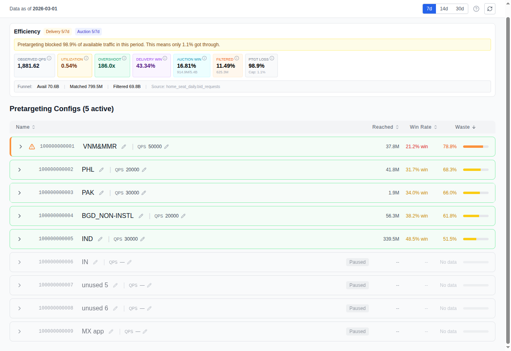
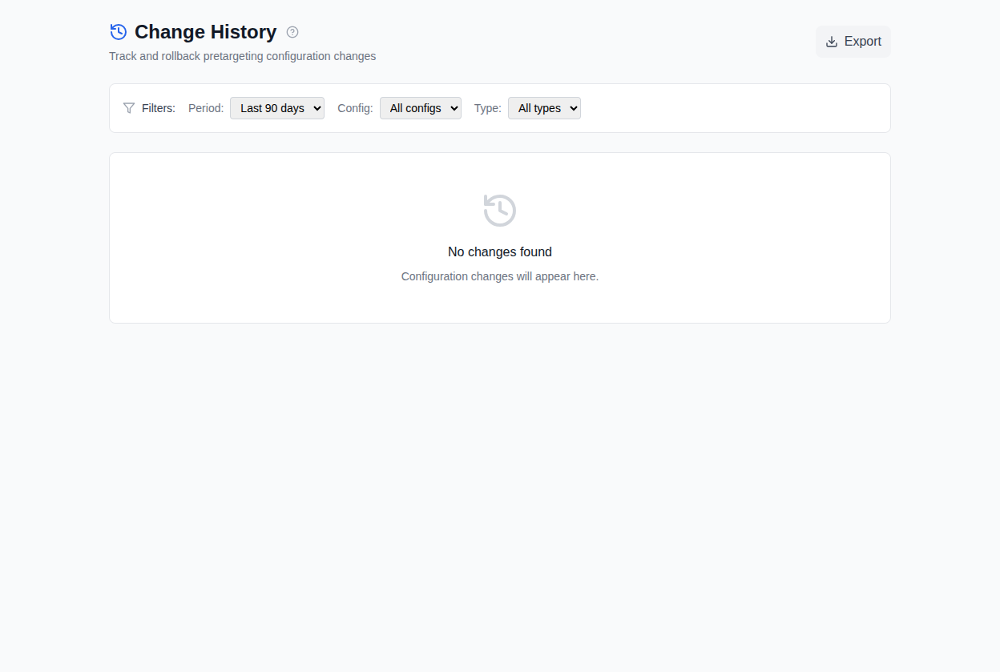

# 第 6 章：预定向配置

*适用读者：媒体买手、投放经理*

预定向配置是你控制 Google 向竞价器发送什么内容的主要杠杆。本章介绍如何
在 Cat-Scan 中安全地管理它们。

## 预定向配置控制什么

每个配置是一组规则，告诉 Google："只向我发送符合这些条件的竞价请求。"
每个席位有 **10 个配置**。

| 字段 | 过滤内容 |
|------|---------|
| **状态** | 激活（接收流量）或暂停（已停止）。 |
| **最大 QPS** | 此配置接受的每秒查询上限。 |
| **地区（包含）** | 接收流量的国家、地区或城市。 |
| **地区（排除）** | 即使匹配包含条件也要屏蔽的地理位置。 |
| **尺寸（包含）** | 接受的广告尺寸（如 300x250、728x90）。 |
| **格式** | 素材类型：VIDEO、DISPLAY_IMAGE、DISPLAY_HTML、NATIVE。 |
| **平台** | 设备类型：DESKTOP、MOBILE_APP、MOBILE_WEB、CONNECTED_TV。 |
| **发布商** | 特定发布商域名或应用的允许/拒绝列表。 |

## 解读配置卡片

在首页和设置中，每个配置以卡片形式显示当前状态。

重点关注：

- **激活 + 高最大 QPS + 宽泛地区** = 此配置捕获了大量流量。如果同时
  高浪费，它就是你最大的优化目标。
- **暂停** = 未接收流量。适合在上线前暂存变更。
- **包含尺寸：（全部）** = 接受 Google 发送的所有广告尺寸。对于固定尺寸
  展示广告，这几乎肯定是浪费的。

## 进行变更

### 试运行工作流

1. 导航到要更改的配置（首页或 `/settings/system`）。
2. 选择要修改的字段（如排除地区、包含尺寸）。
3. 输入新值。
4. 点击**预览**（试运行）。Cat-Scan 展示将要发生的确切变更，但不实际
   应用。
5. 如果预览正确，点击**应用**。
6. 变更被记录在历史中，包含时间戳和你的身份信息。

### 发布商允许/拒绝编辑器

对于发布商级别的屏蔽，Cat-Scan 为每个配置提供专门的编辑器。你可以：
- 按域名搜索发布商
- 屏蔽单个域名或应用
- 允许特定域名（覆盖更广泛的屏蔽）
- 批量应用变更

这比通过 Authorized Buyers UI 管理发布商简便得多。

## 变更历史（`/history`）

每个预定向变更都记录在 `/history` 的时间线中。

每个条目显示：
- **时间**：变更时间戳
- **谁**：执行变更的用户
- **什么**：字段名称、旧值、新值
- **类型**：变更类型（添加、删除、更新）

## 回滚

如果某个变更导致问题（如浪费增加、胜出率下降），你可以回滚：

1. 前往 `/history`。
2. 找到要撤销的变更。
3. 点击**预览回滚**，展示恢复到之前状态的试运行。
4. 可选：添加回滚原因。
5. 点击**确认回滚**。

回滚本身作为新条目记录在历史中，所以你有完整的审计追踪。

## 相关内容

- [按维度分析浪费](04-analyzing-waste.md)：找到需要更改的内容
- [优化器](07-optimizer.md)：配置变更的自动建议
- 运维相关：配置快照以版本化实体存储。参见[数据库操作](14-database.md)。
