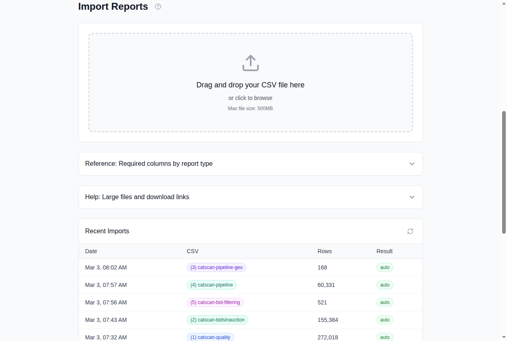

# 第 9 章：数据导入

*适用读者：媒体买手、投放经理*

Cat-Scan 的分析完全依赖于 Google Authorized Buyers 的效果数据。由于
Google 不提供报告 API，所有数据来自 CSV 导出文件。本章说明如何将数据导入
Cat-Scan 以及如何验证数据到达。

## 为什么这很重要

没有导入的数据，Cat-Scan 就没有分析对象。漏斗、浪费视图、素材表现和
优化器都依赖于新鲜的 CSV 数据。如果数据过时，你的决策就基于旧信息。

## 数据到达的两种方式

### 1. 手动 CSV 上传（`/import`）

拖放从 Google Authorized Buyers 导出的 CSV 文件。



**工作流程：**

1. 从你的 Google Authorized Buyers 账户导出报告。
2. 在 Cat-Scan 中前往 `/import`。
3. 将文件拖入上传区域（或点击浏览）。
4. Cat-Scan **自动检测报告类型**并显示预览：
   - 必需列 vs. 已发现列
   - 行数和日期范围
   - 任何验证错误
5. 审查预览。如果列需要重新映射，使用列映射编辑器。
6. 点击**导入**。
7. 进度条显示上传状态。超过 5MB 的文件自动分块上传。
8. 结果显示：已导入行数、跳过的重复项、错误（如有）。

**自动检测的报告类型：**

| 类型 | CSV 命名模式 | 包含内容 |
|------|------------|---------|
| bidsinauction | `catscan-report-*` | 每日 RTB 效果：展示、出价、胜出、花费 |
| quality | `catscan-report-*`（质量指标） | 质量信号：可见性、欺诈、品牌安全 |
| pipeline-geo | `*-pipeline-geo-*` | 竞价流的地理细分 |
| pipeline-publisher | `*-pipeline-publisher-*` | 发布商域名细分 |
| bid-filtering | `*-bid-filtering-*` | 出价过滤原因和数量 |

### 2. Gmail 自动导入

Cat-Scan 可以从已连接的 Gmail 账户自动导入报告。

- Google Authorized Buyers 每天通过邮件发送报告。
- Cat-Scan 的 Gmail 集成自动读取这些邮件并导入 CSV 附件。
- 在 `/settings/accounts` > Gmail 报告标签页查看状态，或通过 API 的
  `/gmail/status` 查看。

**验证 Gmail 导入是否正常：**
- 检查 Gmail 状态面板：`last_reason` 应为 `running`。
- 检查 `unread` 计数：大量未读邮件可能表示导入卡住了。
- 检查导入历史中是否有最近的条目。

## 数据新鲜度网格

数据新鲜度网格（在 `/import` 上可见，运行时健康检查也使用）展示一个
**日期 x 报告类型矩阵**：

```
              bidsinauction   quality   pipeline-geo   pipeline-publisher   bid-filtering
2026-03-02    已导入          缺失       已导入          已导入               已导入
2026-03-01    已导入          缺失       已导入          已导入               已导入
2026-02-28    已导入          已导入     已导入          已导入               已导入
...
```

- **已导入**：Cat-Scan 有此日期和报告类型的数据。
- **缺失**：未找到数据。可能报告未导出、Gmail 未收到，或导入失败。

**覆盖率百分比**汇总了在回顾窗口内数据的完整程度。运行时健康检查使用
此指标判断系统是否正常运行。

## 去重

重新导入同一 CSV（或 Gmail 重复处理同一邮件）**不会**造成重复计数。每行
数据被哈希处理，重复项在插入时被跳过。这意味着重新导入始终是安全的。

## 导入历史

`/import` 上的导入历史表显示最近 20 次导入：

- 时间戳
- 文件名
- 行数
- 导入触发方式（手动上传 vs. gmail-auto）
- 状态（完成、失败、重复）

## 故障排除

| 问题 | 检查内容 |
|------|---------|
| 新鲜度网格中的"缺失"单元格 | 该日期是否从 Google 导出了报告？检查 Gmail 中的邮件。 |
| 导入失败并显示验证错误 | 列不匹配。对照必需列表检查你的 CSV。 |
| Gmail 导入显示"已停止" | 检查 `/settings/accounts` > Gmail 标签页。可能需要重启或重新授权。 |
| 覆盖率百分比下降 | 报告正在到达但涵盖的日期少于预期。检查 Google AB 中的导出计划。 |

## 相关内容

- [理解你的 QPS 漏斗](03-qps-funnel.md)：依赖导入数据
- [解读报告](10-reading-reports.md)：导入数据后可以做什么
- 运维相关：数据新鲜度查询内部机制和故障排除，参见[数据库操作](14-database.md)
  和[故障排除](15-troubleshooting.md)。
